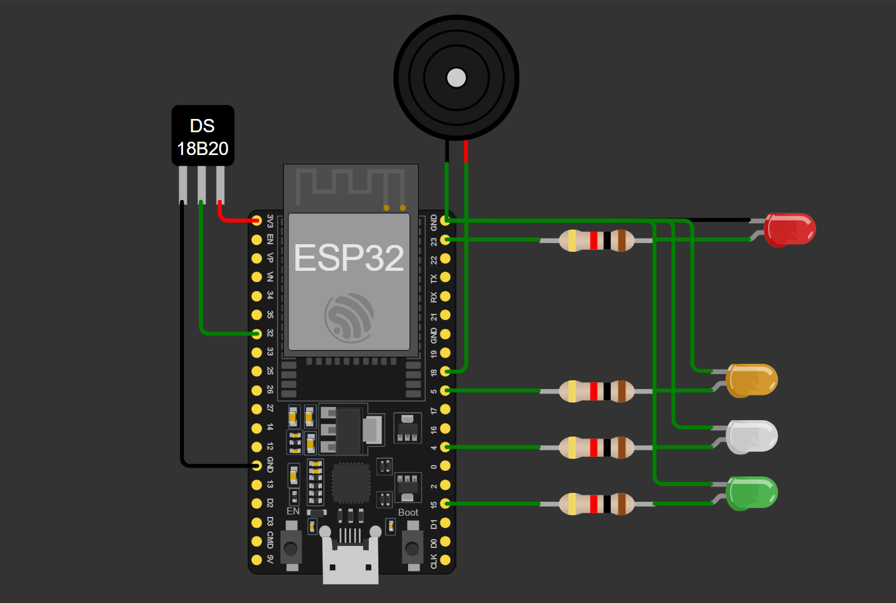

# ESP32 Temperature Alert System

This is a beginner-friendly project made using ESP32 and DS18B20 temperature sensor.  
The system lights up different LEDs and activates a buzzer based on the temperature.

##  Components Used
- ESP32
- DS18B20 Temperature Sensor
- Red, Green, Orange, White LEDs
- Buzzer
- Resistors (220Ω for LEDs)
- Breadboard and jumper wires

##  How it Works
- **Green LED**: Temperature is normal (10°C to 45°C)
- **Orange LED**: High temperature (45°C to 60°C)
- **Red LED + Buzzer**: Critical temperature (Above 60°C)
- **White LED + Buzzer**: Very low temperature (Below 10°C)

##  Simulation

This project was tested and simulated on Wokwi:  
👉 [Click here to view the Wokwi simulation](https://wokwi.com/projects/435369335229707265)

##  Circuit Diagram

Below is the screenshot of the Wokwi simulation circuit:

## ✅ Status
✅ Working and tested on Wokwi  
✅ Code uploaded to GitHub

##  Author
Made by Gourav Kumar Jha (Beginner in IoT and Embedded Systems)
